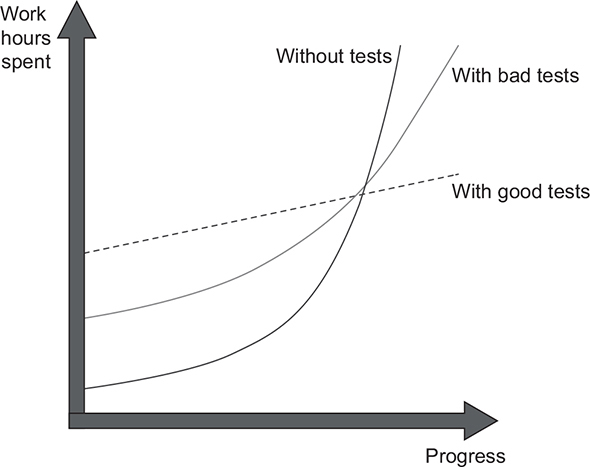

# Unit Test Principle

## Chapter 1. The goal of unit testing

### The relationship between unit testing and code design

- Unit test is a good negative indicator, but it's a bad positive indicator:

  - If you find that code is hard to unit test, it’s a strong sign that the code needs improvement. (code is tight coupling).
  - The fact that you can easily unit test your code base doesn’t necessarily mean it’s of good quality.
  The project can be a disaster even when it exhibits a high degree of decoupling

The difference in growth dynamics between projects with good and bad tests. A project with badly written tests exhibits the properties of a project with good tests at the beginning, but it eventually falls into the stagnation phase.


- You can’t achieve the goal of unit testing by just throwing more tests at the project. You need to consider both the test’s value and its upkeep cost. The cost component is determined by the amount of time spent on various activities:

  - Refactoring the test when you refactor the underlying code
  - Running the test on each code change
  - Dealing with false alarms raised by the test
  - Spending time reading the test when you’re trying to understand how the underlying code behaves

- Code is a liability, not an asset. The more code you introduce, the more you extend the surface area for potential bugs in your software, and the higher the project’s upkeep cost. It’s always better to solve problems with as little code as possible. And Tests are code, too. You should view them as the part of your code base that aims at solving a particular problem: ensuring the application’s correctness. Unit tests, just like any other code, are also vulnerable to bugs and require maintenance.

### Using coverage metrics to measure test suite quality

It’s the same situation as with the ability to unit test the code: coverage metrics are a good negative indicator but a bad positive one.

If a metric shows that there’s too little coverage in your code base—say, only 10%—that’s a good indication that you are not testing enough. But the reverse isn’t true: even 100% coverage isn’t a guarantee that you have a good-quality test suite. A test suite that provides high coverage can still be of poor quality.

#### Code coverage metric (also known as test coverage)

This metric shows the ratio of the number of code lines executed by at least one test and the total number of lines in the production code base.

Example:

```Ruby
  def is_long_string(str)   # 1
    if str.length > 10 # 1
      return true #2
    end# 1
    return false # 1
  end # 1

  # unit test
  assert_equal false, is_long_string('abcde')
```

_1 Covered by the test_
_2 Not covered by the test_

This gives us 4/5 = 0.8 = 80% code coverage.

If I refactor code like this:

```Ruby
  def long_string?(str)
    str.length > 10 ? true : false
  end
```

This gives us 100% code coverage. But the test still verifies the same number of possible outcomes.

As you see, i didn't improve the test suite with this refactoring.

#### The branch coverage metric

Branch coverage provides more precise results than code coverage because it helps cope with code coverage’s shortcomings. Instead of using the raw number of code lines, this metric focuses on control structures, such as if and switch statements.

```Ruby
  def long_string?(str)
    str.length > 10 ? true : false
  end
```

There are 2 branches in above example: one for the situation when the length of the string argument is greater than five characters, and the other one when it’s not.
The test covers only one of these branches, so the branch coverage metric is **1/2 = 0.5 = 50%**

Although the branch coverage metric yields better results than code coverage, you still can’t rely on either of them to determine the quality of your test suite, for two reasons:

1. You can’t guarantee that the test verifies all the possible outcomes of the system under test.
2. No coverage metric can take into account code paths in external libraries.

- Example for (1)

```Ruby
  class Example

    def initialize
      @str = ''
      @is_only_number = false
    end

    def check_str(str)
      is_number = /\d+/.match(str) ? true : false
      @is_only_number = is_number
      is_number
    end
  end

# a bad test code:

test 'check_str' do
  example= Example.new
  assert_equal true, check_str('12323')
  assert_equal false, check_str('abc12a')
end

```

The `check_str` method now has two outcomes: an explicit one, which is encoded by the return value; and an implicit one, which is the new value of the property. And in spite of not verifying the second, implicit outcome, the coverage metrics would still show the same results: 100% for the code coverage and 100% for the branch coverage. As you can see, the coverage metrics don’t guarantee that the underlying code is tested, only that it has been executed at some point. If you remove `@is_only_number = is_number` line, the test code still pass.


- Example for (2) - No coverage metric can take into account code paths in external libraries

```Ruby
  # bert is 3rd party libary
  class Bert
    def self.encode(obj)
      case obj
        when Symbol then "symbol"
        when String then "string"
        else
          fail(obj)
      end
    end
  end


  # code on our application
  def encode(val)
    Bert.encode(val)
  end

  # test code

  test "encode should return class name of value" do
    assert_equal 'string', encode("abc")
  end
```

The branch coverage metric shows 100%, and the test verifies all components of the method’s outcome.
It has a single such component anyway—the return value. At the same time, this test is nowhere near being exhaustive.
It doesn’t take into account the code paths the `bert` libray’s `encode` method may go through.

The `Bert.encode` has plenty of branches that are hidden from the test and that might lead to different results.
Here are just a few possible arguments:

- `null` value
- `interger` value
....

This is not to say that coverage metrics should take into account code paths in external libraries (they shouldn’t), but rather to show you that you can’t rely on those metrics to see how good or bad your unit tests are. Coverage metrics can’t possibly tell whether your tests are exhaustive; nor can they say if you have enough tests.


**An extreme Example**:

```Ruby
  class Example

    def initialize
      @str = ''
      @is_only_number = false
    end

    def check_str(str)
      is_number = /\d+/.match(str) ? true : false
      @is_only_number = is_number
      is_number
    end
  end

test 'check_str' do
   example = Example.new
   result  = check_str('12323')
   result2 = check_str('abc12a')
end
```

This test has both code and branch coverage metrics showing 100%. But at the same time, it is completely useless because it doesn’t verify anything.


[A story from the author of the book](./Story1.md)


## Chapter 4. The four pillars of a good unit test

- Protection against regressions
- Resistance to refactoring
- Fast feedback
- Maintainability

### Protection against regressions

- Note that it’s not only the amount of code that matters, but also its complexity and domain significance. Code that represents complex business logic is more important than boilerplate code—bugs in business-critical functionality are the most damaging.

- Furthermore, in addition to your code, the code you didn’t write also counts: for example, libraries, frameworks, and any external systems used in the project. That code influences the working of your software almost as much as your own code. For the best protection, the test must include those libraries, frameworks, and external systems in the testing scope, in order to check that the assumptions your software makes about these dependencies are correct.

### Resistance to refactoring

The second attribute of a good unit test is resistance to refactoring—the degree to which a test can sustain a refactoring of the underlying application code without turning red (failing).

This situation is called a false positive. A false positive is a false alarm. It’s a result indicating that the test fails, although in reality, the functionality it covers works as intended.

To evaluate how well a test scores on the metric of resisting to refactoring, you need to look at how many false positives the test generates. The fewer, the better.

Example:

```Ruby
  def take_x_character(x)
    str.slice(0, x)
  end

  # a bad test code
  test "take_x_character" do
    a_str = 'aaaa'
    a_str.expects(:slice).with(0, 3).returns("cds").once
    assert_equal "cds", take_x_character(3)
  end
```

after 3 days, you decide to refactor your code as following. And the test failed.

```Ruby
  def take_x_character(x)
    str[0..(x-1)]
  end
```

[A story from the trenches](./Story2.md)